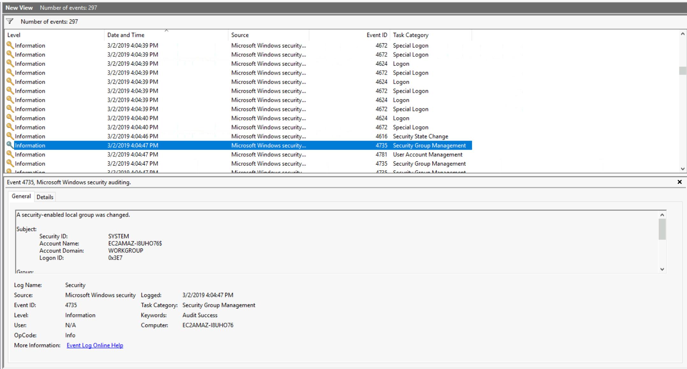
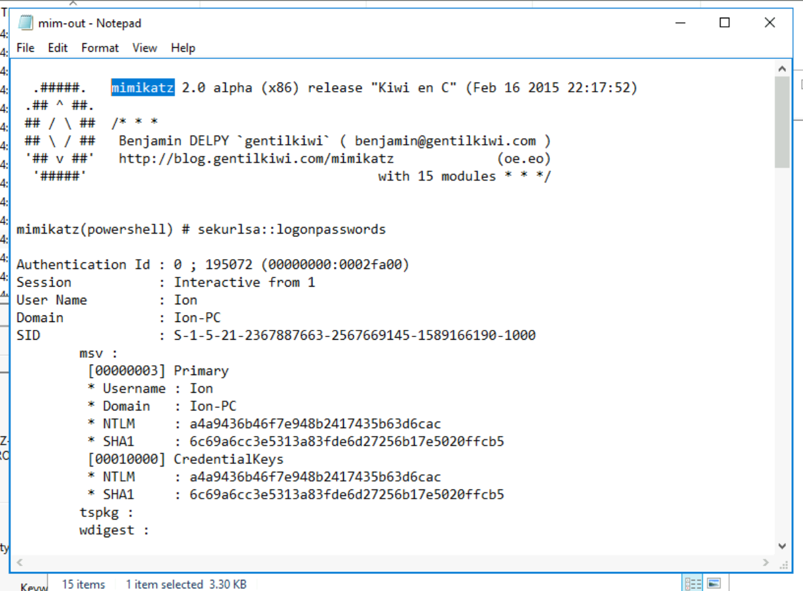
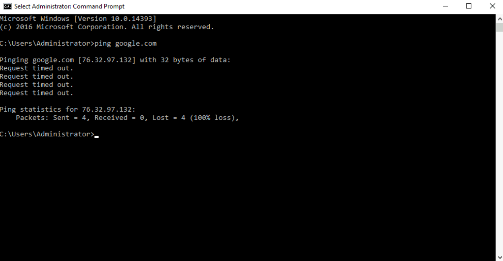
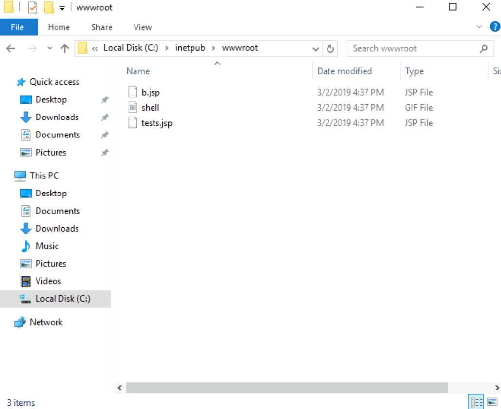
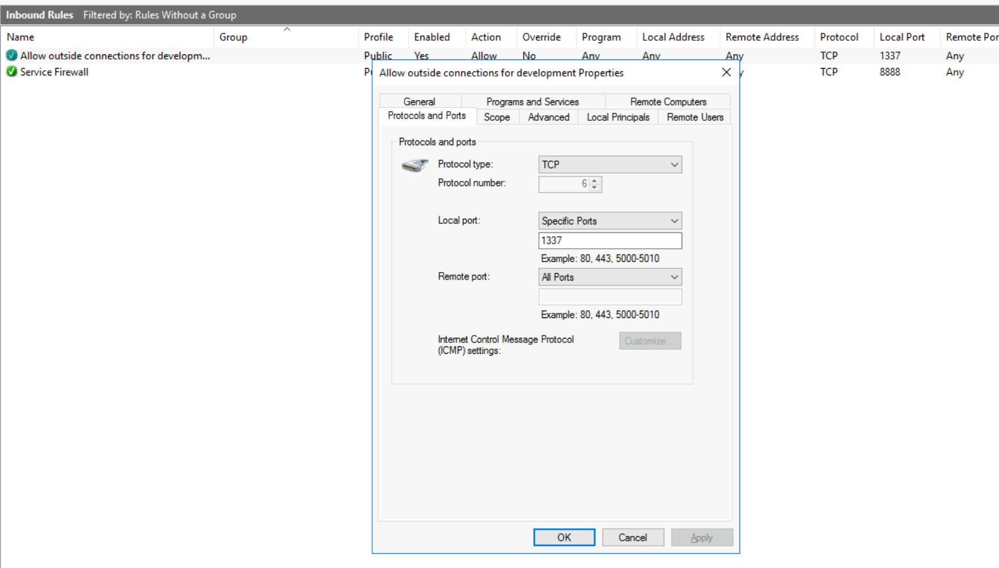

# 🕵️‍♀️ Investigação de Incidente: Windows - Credencial Comprometida

🔍 Este projeto simula a investigação de um incidente em um sistema Windows, com login anômalo, atividades suspeitas e possível shell remota. O objetivo é identificar comportamentos maliciosos e mapear as TTPs usadas pelos atacantes.

## ⚠️ Contexto do Alerta

Durante análise rotineira, foi identificado um login fora do horário usual. Em seguida, surgiram indícios de alteração no sistema, possível uso de ferramenta de extração de senhas e atividade de rede incomum.

## 🧪 O que foi investigado

- Logs de login e execução de programas
- Presença de ferramentas suspeitas (ex: Mimikatz)
- Arquivos web suspeitos (.jsp)
- Regra de firewall personalizada
- Alteração no arquivo `hosts`
- Indício de comunicação com IP malicioso

## 🖼️ Evidências Coletadas

### 🧑‍💻 Login anômalo
  
> 🟡 **Logon suspeito:** Evento 4624 mostra login bem-sucedido em horário incomum, possível uso indevido de credencial comprometida.

### 🔓 Execução do Mimikatz
  
> 🔴 **Credential Dumping:** Execução do Mimikatz com extração de senhas em texto claro — confirmação de atividade maliciosa local.

### 🧪 Manipulação do arquivo hosts
  
> ⚠️ **Manipulação de resolução DNS local:** O arquivo `hosts` foi alterado para redirecionar `google.com` a um IP malicioso, mascarando comunicação C2 ou impedindo acessos legítimos.

### 📡 Ping revelando IP falso
  
> 🧾 **Confirmação da manipulação:** O comando `ping google.com` retorna IP diferente do esperado, validando a alteração local do arquivo `hosts`.

### 💻 Webshell JSP detectada
  
> 🟠 **Webshell detectada:** Arquivos `.jsp` localizados no diretório do servidor web (`wwwroot`). Indica upload de shell para controle remoto.

### 🔥 Regra de Firewall suspeita
  
> 🔴 **Porta 1337 aberta:** Regra personalizada no Firewall permite conexões externas via porta 1337. Indício de canal C2 ativo.

## 🛠️ Ferramentas usadas

- 💻 **TryHackMe** - Investigating Windows
- 🔍 **Windows Event Viewer** - Para análise de logs de segurança
- 🔥 **Windows Firewall** - Para verificar regras de firewall
- 🧠 **Mimikatz** - Para extração de credenciais (detecção)

## 🧠 Análise Técnica

### 1. **Login fora do horário (Event ID 4624)**
- **Técnica MITRE:** T1078 - **Valid Accounts**
- **Análise:** O login foi realizado em um horário atípico, sugerindo que um atacante pode ter usado credenciais válidas para obter acesso ao sistema de forma ilegítima. Esse tipo de evento é um indicador clássico de **credenciais comprometidas**.

### 2. **Execução do Mimikatz**
- **Técnica MITRE:** T1003 - **Credential Dumping**
- **Análise:** A execução do Mimikatz, ferramenta usada para extração de credenciais da memória, confirma que o atacante obteve acesso e está tentando se movimentar lateralmente no ambiente. A extração de credenciais é uma técnica comum para escalar privilégios e continuar o ataque.

### 3. **Webshell JSP**
- **Técnica MITRE:** T1059.007 – **Command and Scripting Interpreter: JavaScript / JSP**
- **Análise:** A presença de arquivos `.jsp` no diretório `wwwroot` sugere a instalação de uma **webshell**, permitindo que o atacante tenha controle remoto sobre o servidor afetado. Isso configura uma técnica de **persistência** no sistema.

### 4. **Alteração do arquivo `hosts`**
- **Técnica MITRE:** T1562.001 – **Impair Defenses: Disable or Modify Tools**
- **Análise:** A modificação do arquivo `hosts` para redirecionar tráfego DNS a um IP malicioso é uma forma de **interferência na resolução local de domínios**, com objetivo de camuflar comunicações C2 ou bloquear acessos legítimos.

### 5. **Regra de Firewall suspeita**
- **Técnica MITRE:** T1071.001 – **Application Layer Protocol: Web Protocols**
- **Análise:** A criação de uma regra de firewall permitindo conexões externas na porta 1337 é uma evidência de que o atacante configurou um canal de comunicação externo (C2). Isso pode ser um ponto crítico de controle remoto, onde o atacante pode executar comandos no sistema comprometido.

## ✅ Conclusão

🟥 **Incidente confirmado:** O ataque envolveu o uso de credenciais comprometidas para acesso indevido ao sistema, extração de senhas com o Mimikatz, presença de webshell para persistência e comunicação via canal C2 através de regra de firewall maliciosa.

**Ações recomendadas:**
- **Revogar credenciais comprometidas** e forçar a redefinição de senhas.
- **Bloquear IPs maliciosos** que possam estar comunicando com o sistema.
- **Restaurar as configurações do arquivo `hosts`** e garantir que não haja redirecionamentos DNS indesejados.
- **Desabilitar regra de firewall maliciosa** e monitorar tráfego de rede.
- **Investigar outros sistemas na rede** para possíveis comprometimentos similares.

📄 Relatório técnico completo em: [`relatório.pdf`](./Relatório.pdf)
