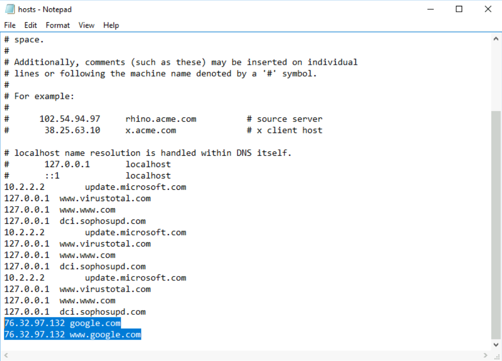

# 🕵️‍♀️ Investigação de Incidente: Windows - Credencial Comprometida

🔍 Projeto simula a investigação de um incidente em host Windows, com login anômalo, atividades suspeitas e possível shell remota.

## ⚠️ Contexto do Alerta

Durante análise rotineira, foi identificado um login fora do horário usual. Em seguida, surgiram indícios de alteração no sistema, possível uso de ferramenta de extração de senhas e atividade de rede incomum.

## 🧪 O que foi investigado

- Logs de login e execução de programas
- Presença de ferramentas suspeitas (ex: Mimikatz)
- Arquivos web suspeitos (.jsp)
- Regra de firewall personalizada
- Alteração no arquivo `hosts`
- Indício de comunicação com IP malicioso

## 🖼️ Evidências

### 🔑 Extração de senhas com Mimikatz
  
> Ferramenta flagrada em execução, mostrando credenciais na memória.

### 🌐 IP malicioso no arquivo `hosts`
  
> DNS spoofing: domínio redirecionado para IP externo malicioso.

### 🧾 Login suspeito
  
> Login fora do horário padrão por usuário legítimo.

### 💻 JSP Shell detectada
  
> Webshell presente no servidor local.

### 🔥 Regra de firewall alterada
  
> Porta 1337 liberada por regra suspeita.

## 🛠️ Ferramentas usadas

- 💻 TryHackMe - Investigating Windows
- 🔍 Windows Event Viewer
- 🔥 Firewall configurator
- 📂 Explorer / Terminal
- 🧰 Mimikatz (detectado)

## ✅ Conclusão

🟥 Incidente confirmado: shell remota instalada + extração de credenciais.

📄 Relatório técnico completo em: [`report.md`](./report.md)
